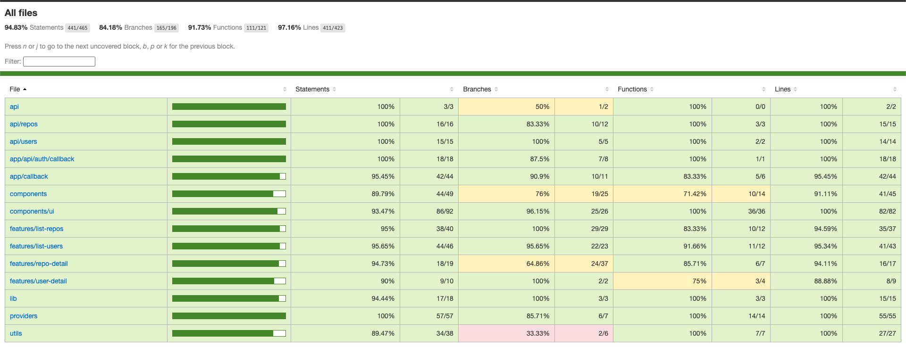

# 🚀 GitHub Repositories Explorer

[](https://nextjs.org/)
[](https://www.typescriptlang.org/)
[](https://tailwindcss.com/)
[](https://tanstack.com/query)
[](https://jestjs.io/)

> 🔍 **Discover and explore GitHub users and their repositories with style!**
> A modern, responsive web application built with Next.js, featuring GitHub OAuth authentication, infinite scrolling, and beautiful UI components.

## 🎥 Demo

<div align="center">

**See the app in action!**

### 🖥️ Desktop Experience


### 📱 Mobile Experience


_Experience the smooth user interface, search functionality, and responsive design across all devices_

</div>

## ✨ Features

### 🔐 **Authentication & Security**

- **GitHub OAuth Integration** - Secure login with your GitHub account
- **Token-based Authentication** - Persistent login sessions
- **Rate Limiting Protection** - Smart error handling for API limits

### 👥 **User Exploration**

- **🔍 User Search** - Find GitHub users by username with real-time search
- **📊 User Profiles** - View detailed user information and statistics
- **🔗 Quick Access** - Direct links to user's GitHub profile, followers, following, and more
- **⚡ Responsive UI** - Beautiful user cards with hover effects

### 📚 **Repository Discovery**

- **♾️ Infinite Scrolling** - Seamlessly browse through repositories
- **🏷️ Language Detection** - Color-coded programming languages
- **⭐ Repository Stats** - Stars, forks, watchers, and size information
- **📅 Metadata Display** - Creation dates, last updates, and descriptions
- **🔗 External Links** - Quick access to GitHub repository pages
- **📊 Detailed Information** - License, default branch, and clone URLs

### 🎨 **User Interface & Experience**

- **🌙 Dark/Light Mode** - Toggle between themes with persistent preference
- **📱 Responsive Design** - Perfect on desktop, tablet, and mobile devices
- **🎭 Modern Components** - Built with Radix UI primitives and custom styling
- **✨ Smooth Animations** - CSS transitions and micro-interactions
- **🚀 Fast Loading** - Optimized with Next.js and React Query caching
- **📐 Drawer/Modal System** - Elegant detail views for users and repositories

### 🛠️ **Technical Features**

- **⚡ Performance Optimized** - Server-side rendering and static generation
- **🔄 Real-time Updates** - React Query for efficient data fetching
- **🧪 Comprehensive Testing** - Unit tests with Jest and Testing Library
- **📊 Code Coverage** - Detailed testing reports
- **🎯 TypeScript** - Full type safety and better developer experience
- **🔍 SEO Optimized** - Meta tags, structured data, and sitemap

## 🛠️ Tech Stack

### **Frontend Framework**

- **Next.js 15.3.3** - React framework with App Router
- **React 19** - Latest React with concurrent features
- **TypeScript** - Static type checking

### **Styling & UI**

- **TailwindCSS 4.0** - Utility-first CSS framework
- **Radix UI** - Accessible component primitives
- **Lucide React** - Beautiful icon library
- **next-themes** - Theme switching support
- **Vaul** - Drawer component for mobile

### **State Management & Data Fetching**

- **TanStack Query (React Query)** - Server state management
- **Axios** - HTTP client for API requests
- **React Context** - Client state management

### **Development & Testing**

- **Jest** - JavaScript testing framework
- **Testing Library** - React component testing utilities
- **ESLint** - Code linting and formatting
- **Prettier** - Code formatting

### **Authentication & APIs**

- **GitHub OAuth** - Secure authentication
- **GitHub REST API** - User and repository data
- **Local Storage** - Token persistence

## 🚀 Getting Started

### Prerequisites

- **Node.js** 18.0 or higher
- **npm** or **yarn** package manager
- **GitHub OAuth App** credentials

### Installation

1. **Clone the repository**

   ```bash
   git clone https://github.com/thoriqdharmawan/github-repositories-explorer.git
   cd github-repositories-explorer
   ```

2. **Install dependencies**

   ```bash
   npm install
   # or
   yarn install
   ```

3. **Set up environment variables**

   Create a `.env` file in the root directory:

   ```env
   NEXT_PUBLIC_APP_API_URI=https://api.github.com
   NEXT_PUBLIC_HOMEPAGE_URI=http://localhost:3000 (optional)
   NEXT_PUBLIC_AUTHORIZATION_CALLBACK_URI=http://localhost:3000/callback (optional)
   NEXT_PUBLIC_CLIENT_ID=your-client-id-from-github (optional)
   CLIENT_SECRET=your-secret-from-github (optional)
   NEXT_PUBLIC_BASE_URL=http://localhost:3000 (optional)
   ```

4. **GitHub OAuth Setup**

   - Go to [GitHub Developer Settings](https://github.com/settings/developers)
   - Create a new OAuth App
   - Set Authorization callback URL to: `http://localhost:3000/callback`
   - Copy the Client ID to your `.env` file

5. **Run the development server**

   ```bash
   npm run dev
   # or
   yarn dev
   ```

6. **Open your browser**

   Navigate to [http://localhost:3000](http://localhost:3000) 🎉

## 🐳 Docker Setup (Alternative)

Prefer using Docker? Here's a quick setup guide:

### Prerequisites
- **Docker** and **Docker Compose** installed on your machine

### Quick Start with Docker

1. **Clone and navigate to the project**
   ```bash
   git clone https://github.com/thoriqdharmawan/github-repositories-explorer.git
   cd github-repositories-explorer
   ```

2. **Set up environment variables** (same as above)
   ```env
   NEXT_PUBLIC_APP_API_URI=https://api.github.com
   # Add other environment variables as needed
   ```

3. **Choose your Docker setup:**

   **🔥 Development Mode (with hot reload):**
   ```bash
   npm run docker:dev
   # or use docker-compose directly
   docker-compose --profile dev up dev --build
   ```

   **🚀 Production Mode:**
   ```bash
   # Build production image
   npm run docker:build

   # Start production server
   npm run docker:start
   ```

4. **Access the application**
   - Open [http://localhost:3000](http://localhost:3000) in your browser

### 🛠️ Docker Commands

| Command                | Description                                    |
| ---------------------- | ---------------------------------------------- |
| `npm run docker:dev`   | 🔥 Start development server with hot reload    |
| `npm run docker:build` | 📦 Build production Docker image              |
| `npm run docker:start` | 🚀 Start production server                    |
| `npm run docker:stop`  | 🛑 Stop all containers                        |
| `npm run docker:clean` | 🧹 Remove containers and images               |
| `npm run docker:logs`  | 📋 Show container logs                        |

### 💡 Docker Tips

- **Development mode** includes volume mounting for hot reload
- **Production mode** creates optimized builds for deployment
- All Docker scripts are available in `docker-setup.sh`
- Use `docker-compose logs dev` to check development logs

## 📋 Available Scripts

| Command                      | Description                                |
| ---------------------------- | ------------------------------------------ |
| `npm run dev`                | 🔥 Start development server with Turbopack |
| `npm run build`              | 📦 Build for production                    |
| `npm run start`              | 🚀 Start production server                 |
| `npm run lint`               | 🔍 Run ESLint                              |
| `npm test`                   | 🧪 Run tests                               |
| `npm run test:watch`         | 👀 Run tests in watch mode                 |
| `npm run test:coverage`      | 📊 Generate test coverage report           |
| `npm run test:coverage:open` | 📈 Open coverage report in browser         |

## 🧪 Testing

This project includes comprehensive testing with:

- **Unit Tests** - Component and utility function testing
- **Integration Tests** - API hooks and provider testing
- **Test Coverage** - Detailed coverage reports
- **Continuous Testing** - Watch mode for development

### 📊 Test Coverage Report



Our test suite maintains high code coverage across all modules to ensure reliability and maintainability.

```bash
# Run all tests
npm test

# Run tests with coverage
npm run test:coverage

# Run tests in watch mode
npm run test:watch

# Open coverage report in browser
npm run test:coverage:open
```

## 📁 Project Structure

```
├── 📁 api/                    # API hooks and utilities
│   ├── 📁 repos/             # Repository-related API hooks
│   ├── 📁 users/             # User-related API hooks
│   └── 📁 __test__/          # API tests
├── 📁 app/                   # Next.js App Router
│   ├── 📄 layout.tsx         # Root layout
│   ├── 📄 page.tsx          # Home page
│   └── 📁 api/              # API routes
├── 📁 components/            # Reusable UI components
│   ├── 📁 ui/               # Base UI components
│   └── 📁 __test__/         # Component tests
├── 📁 features/              # Feature-based components
│   ├── 📁 list-users/       # User search and listing
│   ├── 📁 list-repos/       # Repository listing
│   ├── 📁 user-detail/      # User detail view
│   └── 📁 repo-detail/      # Repository detail view
├── 📁 lib/                   # Utility libraries
├── 📁 providers/             # React Context providers
├── 📁 types/                 # TypeScript type definitions
└── 📁 utils/                 # Helper functions
```

## 🎨 UI Components

The project features a comprehensive design system built with:

- **🎯 Consistent Theming** - Dark/light mode support
- **♿ Accessibility** - ARIA compliant components
- **📱 Responsive Design** - Mobile-first approach
- **🎭 Animation** - Smooth transitions and loading states
- **🧩 Modular Components** - Reusable and composable

### Key Components

- `Header` - Navigation with auth and theme toggle
- `SearchInput` - User search functionality
- `UserItem` - User card with details
- `RepoItem` - Repository card with stats
- `DetailViews` - Drawer/modal system for details
- `LoadingState` - Skeleton loading components
- `ErrorState` - Error handling with retry actions

## 🌐 Deployment

### Vercel (Recommended)

1. **Connect your repository** to Vercel
2. **Set environment variables** in Vercel dashboard
3. **Deploy** automatically on every push

### Manual Deployment

```bash
# Build the project
npm run build

# Start the production server
npm start
```

## 👨‍💻 Author

**Thoriq Dharmawan**

- GitHub: [@thoriqdharmawan](https://github.com/thoriqdharmawan)

## 🙏 Acknowledgments

- **GitHub API** - For providing comprehensive repository data
- **Vercel** - For seamless deployment and hosting
- **Next.js Team** - For the amazing React framework
- **Radix UI** - For accessible component primitives
- **TanStack** - For powerful data fetching capabilities

---

<div align="center">

**⭐ Star this repository if you found it helpful!**

[](https://github.com/thoriqdharmawan/github-repositories-explorer/stargazers)
[](https://github.com/thoriqdharmawan/github-repositories-explorer/network/members)

Made with ❤️ and ☕ by [Thoriq Dharmawan](https://github.com/thoriqdharmawan)

</div>
